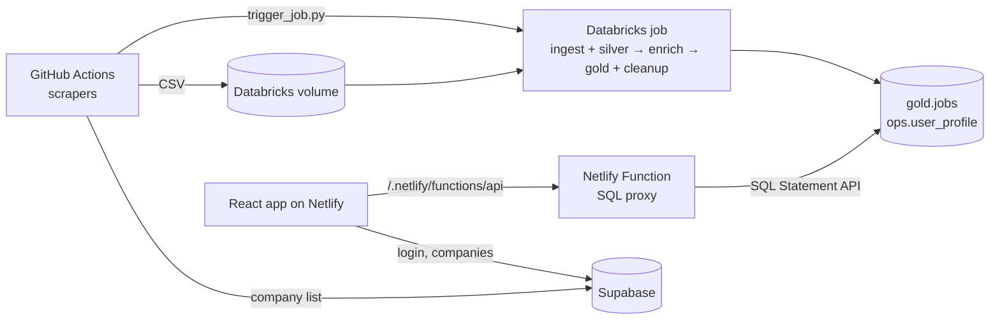

# JobSeeker - AI Assisted

A personal job inbox. Scrapers collect fresh postings a few times a day, a Databricks pipeline cleans, enriches and
scores them against your profile, and a compact, mobile-first React app lets you triage them (apply / hide) fast.
Everything runs on free tiers (GitHub Actions, Databricks Free Edition, Netlify, Supabase).



## Features

- **Fresh jobs only**: the list shows the last 24 hours by default; the pipeline deletes jobs posted more than
  2 days ago that you did not apply to.
- **Fit score (0-100)** per job from your target roles (related roles score partly), skills (rare skills count more)
  and experience, with a breakdown. "For you" hides jobs that ask for more than ~2 years above your maximum.
- **Preferred cities (optional, up to 3)**: each adds LinkedIn searches for your roles in that city; without any, the
  LinkedIn search covers all of India.
- **Fast triage**: list or card view, swipe right = applied, swipe left = hide (with Undo), keyboard shortcuts
  (`j`/`k`, `o`, `a`, `x`, `u`, `/`, `?`), detail drawer with next/previous.
- **Mobile first**: bottom tab bar, bottom-sheet filters, full-screen details, pull to refresh, installable (PWA).
- **Light / dark** theme follows the device.
- **Free-tier friendly**: reads are cached for up to an hour (auto sync), Netlify only deploys on frontend changes.

## Repository layout

| Path | What it is |
|---|---|
| `src/` | React 19 app (Vite, react-router). `pages/` (Jobs, Settings, Login), `components/common/` (list row, card, drawer, filters, metrics), `hooks/`, `lib/api.js` (cached API client), `utils/` |
| `netlify/functions/api/` | Netlify Function: verifies the Supabase login and runs fixed, parameterised SQL on Databricks (`sql.mjs`); tests in `*.test.mjs` |
| `databricks/*.py` | Scrapers (Workday, Greenhouse, LinkedIn) + `upload_to_volume.py`; shared helpers in `scraper_common.py` |
| `databricks/jobs/` | `jobseeker_pipeline.json` (pipeline job), `jobseeker_setup.json` (setup job), `deploy_job.py`, `trigger_job.py` |
| `databricks/notebooks/` | `01_setup` (setup job), pipeline notebooks `02_ingest_silver`, `03_enrich`, `04_gold_cleanup` (+ `_common`, `00_capability_check`) |
| `.github/workflows/` | `databricks-scrapers.yml` (Workday + Greenhouse, 02:07 / 14:07 UTC, upload only), `linkedin-databricks.yml` (every 4 h, uploads and starts the pipeline) |
| `supabase/` | SQL scripts for the Supabase project, run once in its SQL editor |

## Setup

### 1. Web app (local)

Requires Node.js 20+.

```bash
npm install
cp .env.example .env   # fill in the values
npm run dev            # http://localhost:5173 (also serves the API function)
```

`npm run build` builds to `dist/`. Tests: `node --test netlify/functions/api/*.test.mjs src/utils/*.test.js`.
Lint: `npm run lint`.

### 2. Environment variables

| Variable | Where | Purpose |
|---|---|---|
| `VITE_SUPABASE_URL`, `VITE_SUPABASE_ANON_KEY` | `.env`, Netlify (build) | Login in the browser |
| `DATABRICKS_HOST`, `DATABRICKS_TOKEN` | `.env`, Netlify (functions), GitHub secrets | Databricks access (never sent to the browser) |
| `DATABRICKS_WAREHOUSE_ID` | `.env`, Netlify | SQL warehouse (optional, first warehouse otherwise) |
| `ALLOWED_EMAILS` | Netlify | Comma-separated emails allowed to use the job data (strongly recommended) |
| `DATABRICKS_CATALOG`, `DATABRICKS_JOB_NAME` | optional | Defaults `jobseeker`, `JobSeeeker` |
| `SUPABASE_URL`, `SUPABASE_SERVICE_ROLE_KEY` | GitHub secrets | Scrapers read the company list |

### 3. Databricks

One command imports the notebooks, creates or updates both jobs and runs the setup job (re-run it after every
notebook change; the setup job is idempotent and only rewrites reference tables whose content changed):

```bash
python databricks/jobs/deploy_job.py --import-notebooks --run-setup --notify-email you@example.com
```

- `--import-notebooks` imports every `databricks/notebooks/*.ipynb` into the notebook folder (default
  `/Workspace/Users/<you>/JobSeeker`; `--notebook-dir` or `DATABRICKS_NOTEBOOK_DIR` overrides it) and warns about
  workspace notebooks that are no longer in the repo.
- `--run-setup` runs the **JobSeeker setup** job (`01_setup`) and waits for it. `--run-now` also starts a pipeline run.
- `--dry-run` prints both job definitions and changes nothing.

Then set your profile in the app (Settings → Profile).

#### Jobs

| Job | Schedule | Tasks |
|---|---|---|
| `JobSeeeker` | Started by `linkedin-databricks.yml` (queue on, one run at a time) | `Step_01_Ingest_Silver` (`02_ingest_silver`: Auto Loader → bronze, clean + MERGE India jobs → silver) → `Step_02_Enrich` (`03_enrich`: pending rows only; experience, skills, role via cached embeddings + capped LLM calls, `ops.role_similarity`) → `Step_03_Gold_Cleanup` (`04_gold_cleanup`: LinkedIn config files, MERGE → `gold.jobs`, `ops.skill_stats`, expiry; retention daily, OPTIMIZE/VACUUM weekly) |
| `JobSeeker setup` | None (run by `--run-setup` or by hand) | `01_setup`: all DDL, reference data, the setup marker |

All DDL lives in `01_setup`. It ends by setting `jobseeker.setup_version` on `ops.pipeline_runs`; every pipeline
notebook checks it through `_common` and stops with "Run the 'JobSeeker setup' job (01_setup) first" when the catalog
is older than the notebooks. Scheduled runs skip the notebooks' "Inspect" cells to save the Free Edition compute quota.

#### Scrapers and triggers

- Workday + Greenhouse (`databricks-scrapers.yml`) only upload their CSVs; the next LinkedIn-triggered run ingests them.
- LinkedIn (`linkedin-databricks.yml`, every 4 h) uploads, then calls `trigger_job.py --min-interval-hours 3`: no new
  run while one is waiting to start, or when the latest run started less than 3 hours ago (manual dispatches).
  `PIPELINE_MIN_INTERVAL_HOURS` sets the same for other callers (default 0 = off).
- LinkedIn searches every user role × preferred city (India-wide for users without cities), newest first, posted in
  the last 12 hours; jobs already in silver with a description (`config/linkedin_seen_ids.json`) skip the detail
  page. Knobs (workflow `env`): `LINKEDIN_ROLE_TARGET_JOBS` (250 per search), `MAX_LINKEDIN_SEARCHES` (90),
  `LINKEDIN_SEARCH_DELAY_SECONDS` (5).

### 4. Netlify

Build command `npm run build`, publish `dist`, functions `netlify/functions` (see `netlify.toml`). Builds are skipped
when a commit only touches scrapers, notebooks or workflows (each production deploy costs 15 of the 300 free credits).
