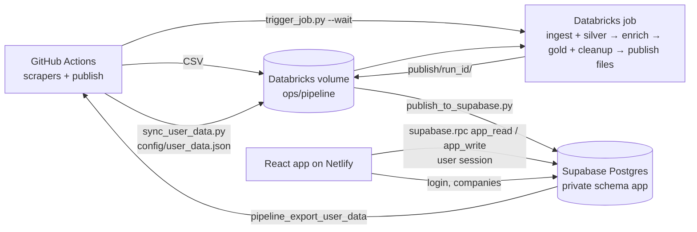

# JobSeeker - AI Assisted

A personal job inbox. Scrapers collect fresh postings a few times a day, a Databricks pipeline cleans and enriches
them, and a compact, mobile-first React app scores them against your profile and lets you triage them (apply / hide)
fast. Everything runs on free tiers (GitHub Actions, Databricks Free Edition, Netlify, Supabase).



The browser never waits for the Databricks SQL warehouse. It calls two Postgres functions (`public.app_read`,
`public.app_write`) with the signed-in user's session, and they score the jobs for that user inside Postgres.
Databricks is only the batch pipeline and never holds a Supabase credential: data moves between the two as files in
the Databricks volume, carried by GitHub Actions (which holds both sets of secrets).

- **Jobs out**: `04_gold_cleanup` writes the gold snapshot to `publish/<run_id>/` (manifest last), and
  `publish_to_supabase.py` sends only the changed rows to Supabase. It never deletes a job someone applied to.
- **User data in**: `sync_user_data.py` exports profiles, applied jobs and custom roles/skills from Supabase to
  `config/user_data.json`, and `02_ingest_silver` loads it at the start of the run (LinkedIn searches, custom-role
  checks and job retention use it).
- **Derived job columns** (city, work mode, employment kind, duplicate group) are computed in Postgres: a trigger on
  `app.jobs` fills them on every publish upsert, and `pipeline_publish_finish` refreshes them after it replaces the
  city reference list. The publish files and the notebooks do not carry them.
- **Run status in**: each scraper writes a small report, which the workflow sends to Supabase; every publish also
  copies the newest Databricks job runs (Jobs API, no compute). Admins see both in Settings → System.

## Features

- **Inbox · Saved · Applied**: the list opens on the Inbox, the jobs you haven't saved, applied to or hidden (For
  you, last 24 hours by default; one scope menu switches to any date or to Everything). The three tabs never count a
  job twice. Jobs you haven't saved or applied to disappear 2 days after posting, at the first update after midnight
  UTC; the "Expiring tonight" strip above the Inbox lists the ones for you that go tonight, and rows say "Disappears
  in ~9h". Applications to postings over 2 days old stay under "Older postings" (they may still be open).
- **New since your last visit**: jobs found since you last opened the app (at least 30 minutes ago) get a dot, and
  the header says "N new since 9:51 AM". An empty Inbox says you're caught up and when the next jobs should arrive.
- **Tracking**: save jobs for later, follow an application through its stages (applied, interviewing, offer,
  rejected, withdrawn) with a note and a follow-up date, and export the Applied tab as CSV.
- **Less noise**: reposts of the same job are shown once ("+2 more · Pune, Chennai"), mute rules hide companies,
  title words or levels, and hiding a job asks why.
- **Fit score (0-100)** per job from your target roles (related roles score partly), skills (rare skills count more)
  and experience, shown as points that add up to it ("49 = 40 role + 7 skills + 2 experience"), with the skills a
  job asks for that are not in your profile ("+ I know this" adds one). "For you" hides jobs that ask for more than ~2 years above your maximum.
- **Preferred cities (optional, up to 3)**: each adds LinkedIn searches for your roles in that city; without any, the
  LinkedIn search covers all of India.
- **Fast triage**: list or card view, swipe right = save, swipe left = hide (Settings → Account "Swipe right marks
  applied" restores the old swipe; touches that start at the screen edge are ignored), with Undo up to 5 steps, bulk
  selection, keyboard shortcuts (`j`/`k`, `o`, `a`, `s`, `t`, `x`, `u`, `/`, `f`, `1`-`3`, `?` for the full list),
  detail drawer with next/previous. The list state is in the URL, so Back and shared links work.
- **Admin**: Settings → System shows a Metrics card (strong-fit applications per active user per week, coverage,
  return and outcome capture; counters only, no job links or searches stored), the pipeline runs, each scraper's last
  result, dropped LinkedIn searches and the database size; Settings → Access manages who may use the app (with each
  user's last activity and applications in the last 7 days).
- **Fast loads**: the last results show instantly from the browser cache and refresh in the background. The page
  says when the job data was last published ("Updated 2 h ago"); after 6 hours it turns amber and a banner says
  the job updates are delayed. It reloads by itself when a new update is published.
- **Mobile first**: fixed bottom bar (Inbox / Saved / Applied / Search / Filters), also in phone landscape and on
  tablets up to 960px, bottom-sheet filters, full-screen details, pull to refresh, installable (PWA).
- **Light / dark** theme follows the device.
- **Free-tier friendly**: no serverless function or warehouse in the request path; Netlify only deploys on frontend
  changes.

## Repository layout

| Path | What it is |
|---|---|
| `src/` | React 19 app (Vite, react-router). `pages/` (Jobs, Settings, Login), `components/common/` (list row, card, drawer, filters, metrics), `hooks/`, `lib/api.js` (cached client for the Supabase RPCs), `utils/` |
| `supabase/` | `app_schema.sql` + `app_api.sql` (private schema `app`, the app RPCs and the service-only pipeline RPCs; applied by `apply.py`), `tests/` (Postgres tests, `parity.py` against the Spark scoring), `multi_user.sql` (login, admin role, companies) |
| `databricks/*.py` | Scrapers (Workday, Greenhouse, LinkedIn) + `upload_to_volume.py`; shared helpers in `scraper_common.py` |
| `databricks/jobs/` | `jobseeker_pipeline.json` (pipeline job), `jobseeker_setup.json` (setup job), `deploy_job.py`, `trigger_job.py`, `sync_user_data.py`, `publish_to_supabase.py` (also records the run history), `record_scrape_report.py` (all three use `supabase_api.py`; dependencies in `requirements.txt`), `migrate_user_data.py` (one-off), `test_scrape_report.py` |
| `databricks/notebooks/` | `01_setup` (setup job), pipeline notebooks `02_ingest_silver`, `03_enrich`, `04_gold_cleanup` (+ `_common`, `00_capability_check`) |
| `.github/workflows/` | `databricks-scrapers.yml` (Workday + Greenhouse, 02:07 / 14:07 UTC, upload only), `linkedin-databricks.yml` (every 4 h: scrape, sync user data, run the pipeline, publish), `publish-supabase.yml` (hourly catch-up publish) |

## Setup

### 1. Web app (local)

Requires Node.js 20+.

```bash
npm install
cp .env.example .env   # fill in the values
npm run dev            # http://localhost:5173 (talks to your Supabase project directly)
```

`npm run build` builds to `dist/`. Lint: `npm run lint`. Tests:

```bash
npm test                                           # node --test src/utils/*.test.js (incl. the SQL constants check)
python -m unittest discover -s supabase/tests -v   # Postgres tests (TEST_DATABASE_URL or SUPABASE_DB_URL; rolled back)
python supabase/tests/parity.py                    # Supabase scoring vs the frozen Spark statements, right after a publish
python databricks/jobs/test_scrape_report.py       # scrape reports, Greenhouse board token, run history (offline)
```

### 2. Environment variables

| Variable | Where | Purpose |
|---|---|---|
| `VITE_SUPABASE_URL`, `VITE_SUPABASE_ANON_KEY` | `.env`, Netlify (build) | Login and all app data in the browser (the only Netlify variables) |
| `DATABRICKS_HOST`, `DATABRICKS_TOKEN` | `.env`, GitHub secrets | Databricks jobs and volume files (scripts and workflows only) |
| `DATABRICKS_WAREHOUSE_ID` | `.env` | SQL warehouse for `migrate_user_data.py` and `parity.py` (optional, first warehouse otherwise) |
| `DATABRICKS_CATALOG`, `DATABRICKS_JOB_NAME` | optional | Defaults `jobseeker`, `JobSeeeker` |
| `SUPABASE_URL`, `SUPABASE_SERVICE_ROLE_KEY` | `.env`, GitHub secrets | Company list for the scrapers, user-data export and job publish (service-only RPCs). Never on Netlify, never in Databricks |
| `SUPABASE_DB_URL` | `.env` only | Postgres connection string for `supabase/apply.py`, `migrate_user_data.py` and the Supabase tests |

Who may use the job data: the `app.allowed_emails` table (empty = any signed-in user; sign-ups are invite-only).
Admins (`app_metadata.role = 'admin'`) always pass and can add or remove emails through the `setAllowedEmail` action.

### 3. Databricks

One command imports the notebooks, creates or updates both jobs and runs the setup job (re-run it after every
notebook change; the setup job is idempotent and only rewrites reference tables whose content changed):

```bash
python databricks/jobs/deploy_job.py --import-notebooks --run-setup --notify-email you@example.com
```

- `--import-notebooks` imports every `databricks/notebooks/*.ipynb` into the notebook folder (default
  `/Workspace/Users/<you>/JobSeeker`; `--notebook-dir` or `DATABRICKS_NOTEBOOK_DIR` overrides it) and warns about
  workspace notebooks that are no longer in the repo.
- `--run-setup` runs the **JobSeeker setup** job (`01_setup`) and waits for it. `--run-now` also starts a pipeline run.
- `--dry-run` prints both job definitions and changes nothing.

Then set your profile in the app (Settings → Profile).

#### Jobs

| Job | Schedule | Tasks |
|---|---|---|
| `JobSeeeker` | Started by `linkedin-databricks.yml` (queue on, one run at a time) | `Step_01_Ingest_Silver` (`02_ingest_silver`: app user data from `config/user_data.json`, Auto Loader → bronze, clean + MERGE India jobs → silver) → `Step_02_Enrich` (`03_enrich`: pending rows only; experience, skills, role via cached embeddings + capped LLM calls, `ops.role_similarity`) → `Step_03_Gold_Cleanup` (`04_gold_cleanup`: LinkedIn config files, MERGE → `gold.jobs`, `ops.skill_stats`, expiry, publish files for Supabase; retention daily, OPTIMIZE/VACUUM weekly) |
| `JobSeeker setup` | None (run by `--run-setup` or by hand) | `01_setup`: all DDL, reference data, the setup marker |

All DDL lives in `01_setup`. It ends by setting `jobseeker.setup_version` on `ops.pipeline_runs`; every pipeline
notebook checks it through `_common` and stops with "Run the 'JobSeeker setup' job (01_setup) first" when the catalog
is older than the notebooks. Scheduled runs skip the notebooks' "Inspect" cells to save the Free Edition compute quota.

#### Scrapers and triggers

- Workday + Greenhouse (`databricks-scrapers.yml`) only upload their CSVs; the next LinkedIn-triggered run ingests them.
- LinkedIn (`linkedin-databricks.yml`, every 4 h) uploads, then calls `trigger_job.py --min-interval-hours 3 --wait`:
  no new run while one is waiting to start, or when the latest run started less than 3 hours ago (manual
  dispatches). `PIPELINE_MIN_INTERVAL_HOURS` sets the same for other callers (default 0 = off).
- LinkedIn searches every user role × preferred city (India-wide for users without cities), newest first, posted in
  the last 12 hours; jobs already in silver with a description (`config/linkedin_seen_ids.json`) skip the detail
  page. Knobs (workflow `env`): `LINKEDIN_ROLE_TARGET_JOBS` (250 per search), `MAX_LINKEDIN_SEARCHES` (90),
  `LINKEDIN_SEARCH_DELAY_SECONDS` (5). Companies rows of type `linkedin` are extra India-wide searches: their
  `api_url` holds the search keywords.
- Greenhouse rows may hold the board token, the board URL or the API URL in `slug` or `api_url` (slug wins);
  `greenhouse.py` derives the token (`board_token`) and always builds the API URL from it.
- **Scrape reports**: every scraper writes `databricks/output/<source>_report.json` on every exit path
  (`jobseeker.scrape_report.v1`: status ok / partial / failed / crashed, totals, one `{name, ok, jobs_found, error}` per
  company or search, and for LinkedIn the search count, the cap and the dropped searches). The composite action's last
  step (`if: always()`, `continue-on-error`) runs `record_scrape_report.py`, which sends it to
  `pipeline_record_scrape`; without a report it records the run as crashed. It always exits 0, so it never fails a
  scrape. Supabase keeps 30 runs per source (`app.scrape_runs`) and the latest result per company
  (`app.scrape_companies`, consecutive failures and the last error), which drive the company health badges.

#### Publishing to Supabase

- `linkedin-databricks.yml` runs three jobs: `linkedin` (scrape + upload), `pipeline` (`sync_user_data.py`, allowed to
  fail so a Supabase outage never stops ingestion, then `trigger_job.py --wait`) and `publish`
  (`publish_to_supabase.py`, also after a failed or timed-out wait).
- `publish-supabase.yml` runs the same publish hourly at :50 (and by hand, with optional `run_id` / `force`). It exits
  in seconds when the newest complete `publish/<run_id>/` is already in Supabase, so the app is at most about an hour
  behind a finished run.
- The publish refuses a snapshot that is older than the published one or that would shrink the job table by more
  than half (`--force` overrides), and never deletes a job any user tracks (applied, any stage, or saved).
- Every publish that applies a run writes `app.publish_history` (newest 50) and prunes hide feedback older than 180
  days. Every publish run that is not a dry run, skipped ones included, then sends the newest 20 runs of the
  `JobSeeeker` job (Jobs API `runs/list`, no compute) to `pipeline_record_runs` (`app.pipeline_runs`, newest 50); a
  failure there only prints a warning. Per-task row counts are not recorded yet (they would need a notebook change).

### 4. Supabase

1. Run `supabase/multi_user.sql` once in the SQL editor (login, admin role, companies).
2. `python supabase/apply.py` applies `app_schema.sql` + `app_api.sql` (idempotent; needs `SUPABASE_DB_URL`;
   `--check` only reports whether it is set). Schema `app` is private: do not add it to the API's exposed schemas.
   Applying also backfills the derived job columns.

Service-only RPCs (service role key, used by the GitHub workflows): `pipeline_export_user_data`, `pipeline_publish_state`,
`pipeline_publish`, `pipeline_publish_finish`, `pipeline_record_scrape` (scrape reports) and `pipeline_record_runs`
(Databricks run history). The admin-only `systemStatus` read combines them with the database size for Settings →
System. Notes, follow-up dates, hide reasons, mute rules and feedback stay in Supabase: the user-data export never
includes them.

### 5. Netlify

Build command `npm run build`, publish `dist` (see `netlify.toml`); there are no functions. Builds are skipped when a
commit only touches scrapers, notebooks, Supabase SQL or workflows (each production deploy costs 15 of the 300 free
credits).

### 6. Moving from the Databricks-served app (one time)

1. `python supabase/apply.py`
2. `python databricks/jobs/deploy_job.py --import-notebooks` (02 keeps the user tables while there is no
   `user_data.json`; 04 writes publish files).
3. Run the pipeline once (or wait for the LinkedIn workflow), then `python databricks/jobs/publish_to_supabase.py`.
4. `python databricks/jobs/migrate_user_data.py --dry-run`, then without `--dry-run` (newest change wins, safe to
   re-run). Run the Supabase tests and `parity.py` (expect 0 mismatches).
5. Push (one Netlify deploy). Re-run `migrate_user_data.py` right away, before the next LinkedIn workflow run, to
   catch changes made on the old app in between (the first sync-in overwrites the Databricks user tables).
6. Remove `DATABRICKS_*` and `ALLOWED_EMAILS` from the Netlify site settings.
